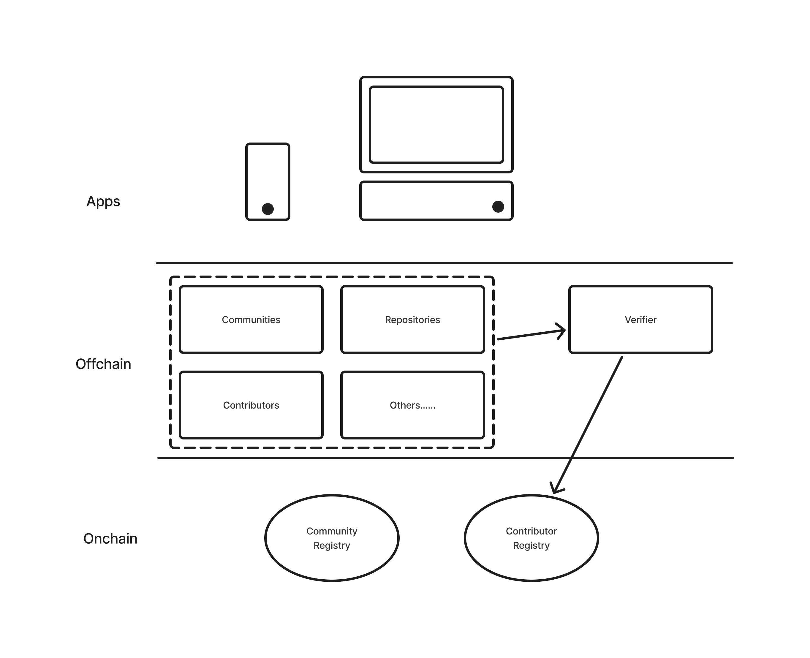

# 👋 About Freire
Freire is a decentralized empowerment tool for community contributors based on the concept of liquid participatory democracy, and also an open contributor reputation system. The name Freire is inspired by the Brazilian educator Paulo Freire, as a tribute to the inspiration from his thoughts. ❤️

The core features of Freire include:

1. **a reputation resume**, integrating collaborative platforms within the community, such as GitHub, Notion, WeChat, Twitter、TG etc., allows for contributions to be automatically recorded.
2. **a governance tool**, using contributor reputation to determine community governance makes the process more democratic, transparent, fair, and efficient, every contributor receives their rightful reputation empowers each community member without relying on a centralized authority.
3. **a data business**, reputation data serves not only as a foundation for community governance but also provides insights for other platforms, facilitating talent discovery and contributing meaningfully to society. This data can enable fair reward distribution and expand various financial applications, such as credit scoring and lending assessments.

# 👀 Why Freire?

As DAOs & communities continue to grow, several real issues arise: Who is qualified to publish the official Twitter? Who has the authority to participate in decision-making regarding the use of public funds? And who grants these permissions? 

This is where Freire comes in.

- **Integrating Cross-Platform Data**

Many community contributions are difficult to effectively record, often being fragmented and scattered. Freire integrates contribution data from Web2 and Web3, assessing contributions based on participant behavior, providing a comprehensive reputation evaluation that breaks down existing limitations in community collaboration, all without the need for additional recording.

- **Reducing Redundant Work and Overcoming the Quantification Paradox**

Once community contributions are quantified, it is easy to slip into the quantification governance paradox, leading to community rigidity. Additionally, external incentives can turn community governance and resource allocation into extra operational burdens. Freire aims to solve this problem through a decentralized and automated approach, utilizing non-linear analysis models to build a reputation system.

- **The Need for Non-Technical Communities**

Github provides developers with a good contribution tracking system through commit records, while [Heyanon](https://www.heyanon.xyz/) verifies contributor identities via Github repositories and uses zk technology to authorize contributors. These insights have greatly inspired me, but non-technical communities lack effective tools, which is why Freire was born.

# 🦾 Freire Architecture

